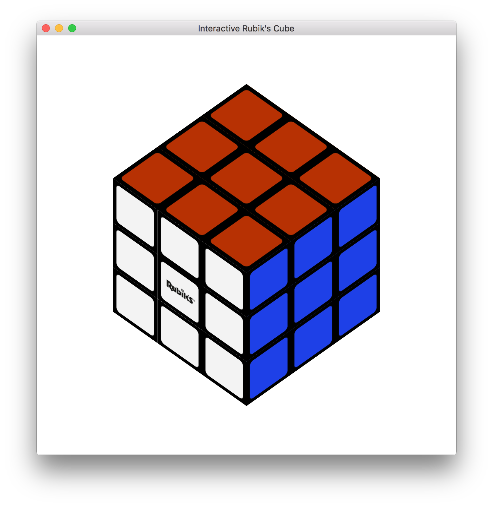
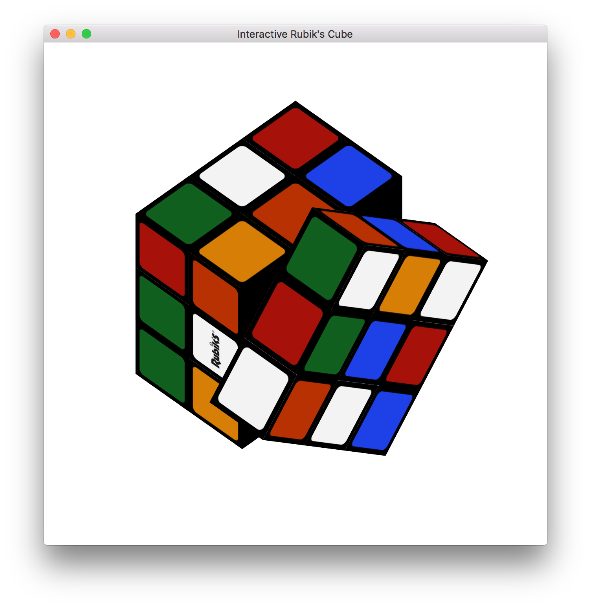

# Interactive Rubik's Cube Modeling

### Objective

- Model an interactive 3x3 Rubik’s cube based on OpenGL

- Every face of the Rubik’s Cube can rotate 90 degrees either clock wise or counter clock wise. Rotations are associate with keyboard keys.

- Users can manually rotate the Rubik’s Cube by dragging a face

- The Rubik's Cube is able to solve itself

- Supports orthographical view

- Users can change the “stickers” of the Rubik’s Cube, which is implemented by texture mapping.

### Library used
- OpenGL

### Key bindings
- <kbd>1</kbd> Reset the cube

- <kbd>C</kbd> Snap to canonical view

- <kbd>F</kbd> Rotate the front face clock wise

- <kbd>B</kbd> Rotate the back face clock wise

- <kbd>R</kbd> Rotate the right face clock wise

- <kbd>L</kbd> Rotate the left face clock wise

- <kbd>U</kbd> Rotate the up face clock wise

- <kbd>D</kbd> Rotate the down face clock wise

- <kbd>SHIFT+F</kbd> Rotate the front face counter clock wise

- <kbd>SHIFT+B</kbd> Rotate the back face counter clock wise

- <kbd>SHIFT+R</kbd> Rotate the right face counter clock wise

- <kbd>SHIFT+L</kbd> Rotate the left face counter clock wise

- <kbd>SHIFT+U</kbd> Rotate the up face counter clock wise

- <kbd>SHIFT+D</kbd> Rotate the down face counter clock wise

- <kbd>SPACE</kbd> Solve the cube

### Results

